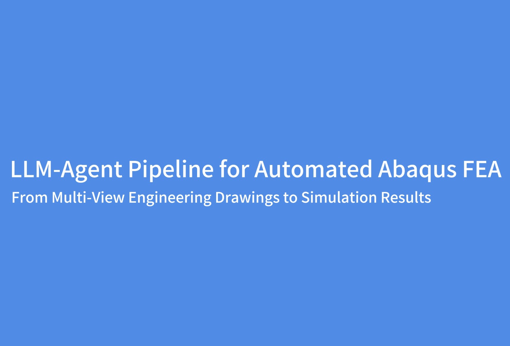

# From engineering drawings to simulation-ready parametric CAD models with LLM-enhanced reconstruction
## Abstract

Constructing accurate parametric three-dimensional CAD models is a prerequisite for       downstream engineering tasks ss (FEA), computational fluiddynamics (CFD), automated fabrication, and digital-twin updating, yet it remains one of the most labor-intensive and expertise-dependent stages in engineering workflows. Existing end-to-end deep-learning approaches for reconstructing parametric CAD models from engineering drawings remain brittle, as small errors in predicted commands or geometric parameters can lead to invalid CAD geometry. Here, we develop an LLM-enhanced reconstruction framework that combines multi-view drawing-to-CAD prediction with a multimodal post-correction for topology repair and local geometric refinement. Evaluated on our self-developed Struct-Bench, which contains 4,258 paired samples from 12 representative families of steel structural members and connections, the proposed post-correction framework reduces the invalid rate from 10.62% to 6.42% and increases command accuracy from 96.25% to 97.95% compared with the end-to-end backbone. Finally, the reconstructed models are integrated into an agent-assisted FE workflow, mitigating the geometric and analysis errors associated with unconstrained LLM generation. These results demonstrate a practical route editable, executable, andsimulation-ready parametric CAD models.

